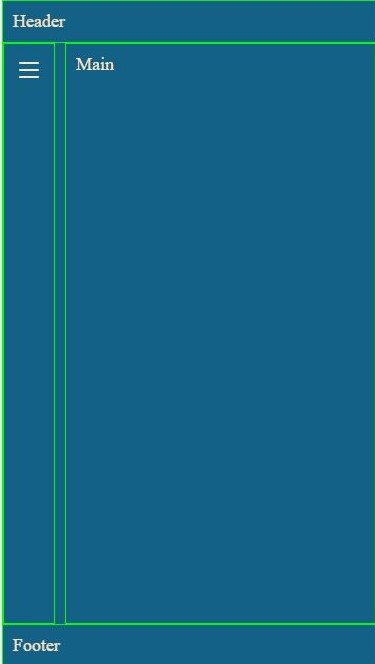
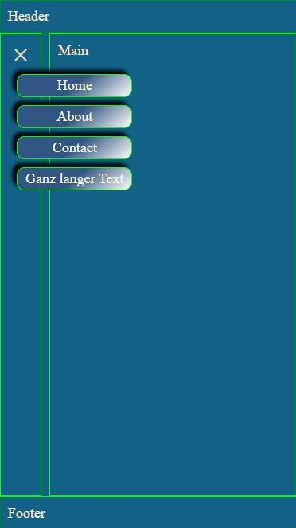
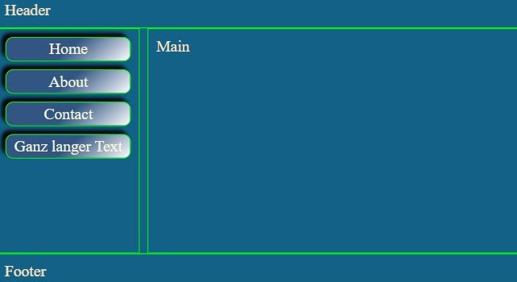
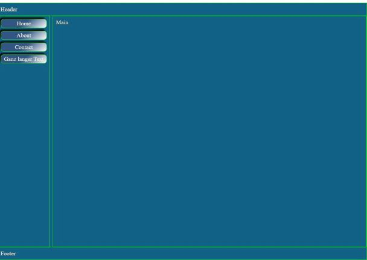

# Template Menu Next.js

This template is only intended as a template for your own projects. There are links, but they have no goals.

The links are in the index.js as an array.
Code:

`  const navElements = [
    { id: 1, name: "Home", link: "#" },
    { id: 2, name: "About", link: "#" },
    { id: 3, name: "Contact", link: "#" },
    { id: 4, name: "Ganz langer Text", link: "#" },
  ];`

## Iphone SE view

### Burger closed



### Burger opened



### Landscape



## Desktop View



This is a [Next.js](https://nextjs.org/) project bootstrapped with [`create-next-app`](https://github.com/vercel/next.js/tree/canary/packages/create-next-app).

## Getting Started

First, run the development server:

```bash
npm run dev
# or
yarn dev
# or
pnpm dev
```

Open [http://localhost:3000](http://localhost:3000) with your browser to see the result.
